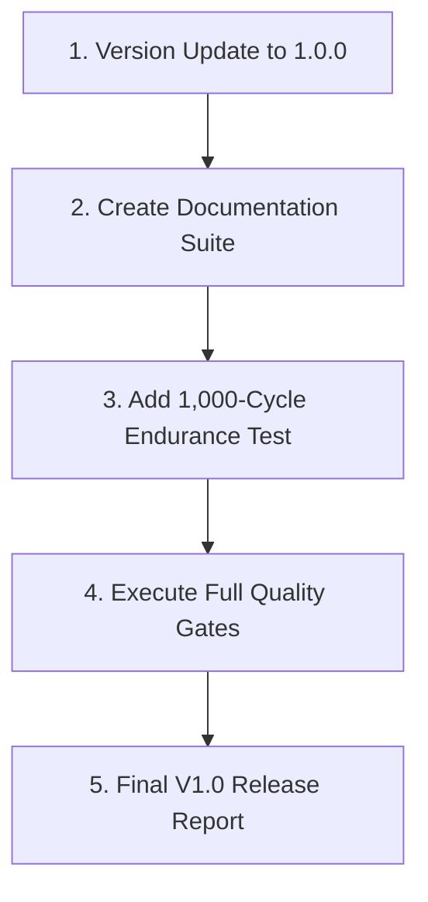

# Javryn V1.0 Implementation Plan

## Executive Summary
Javryn V1.0 establishes the production release milestone for the parallel JavaScript runtime written in Rust. This plan outlines the requirements, architectural stability, public contract definition, documentation strategy, quality gates, and release criteria necessary to transition Javryn from milestone iterations (V0.1–V0.9) into a production-grade release artifact (`1.0.0`).

---

## 1. Release Goals & Non-Goals

### V1.0 Release Goals
1. **Version Alignment**: Unify workspace versioning across all crates (`javryn-core`, `javryn-runtime`, `javryn-cli`) to `1.0.0`.
2. **Public API Stabilization**: Formally define, document, and stabilize public Rust traits, types, and JavaScript globals.
3. **CLI Production Contract**: Freeze CLI arguments, exit code mappings (`0`–`6`), and output streams (stdout for JS output, stderr for logs/diagnostics).
4. **Documentation Completeness**: Produce comprehensive technical documentation including `JAVASCRIPT_COMPATIBILITY.md`, `SECURITY.md`, `PERFORMANCE.md`, `ARCHITECTURE.md`, and `INSTALLATION.md`.
5. **Quality Gate Verification**: Execute a 1,000-cycle endurance test and verify static linting (`clippy -D warnings`), code formatting (`cargo fmt`), workspace compilation, and full test matrix (128+ passing tests).

### Explicit V1.0 Non-Goals
* No JIT compilation or bytecode VM replacement (Boa engine remains standard).
* No multi-node / distributed cluster worker scheduling.
* No `SharedArrayBuffer` / `Atomics` shared memory primitives.
* No Node.js / Browser API emulation beyond `console` and standard timers.
* No OS sandbox guarantees (heap isolation per worker thread; process retains host process permissions).

---

## 2. Public API & Runtime Contract

### Rust API (`javryn-runtime` & `javryn-core`)
| Component | Exposed Symbols | Stability |
|---|---|---|
| **Runtime Control** | `Runtime`, `RuntimeConfig`, `RuntimeConfigBuilder` | **Stable** |
| **Execution Engine** | `JavaScriptEngine`, `BoaEngineAdapter`, `ExecutionResult` | **Stable** |
| **Worker System** | `WorkerManager`, `WorkerHandle`, `WorkerId`, `JsMessage` | **Stable** |
| **Task Management** | `TaskManager`, `TaskPriority`, `Scheduler` | **Stable** |
| **Error Handling** | `RuntimeError`, `ExitCode`, `RuntimeResult` | **Stable** |

### JavaScript Environment Contract
| Category | API | Behavior |
|---|---|---|
| **Standard Globals** | `console.log`, `setTimeout`, `setInterval`, `clearTimeout` | Native Boa bindings with event loop continuation. |
| **Explicit Parallelism** | `parallel.map(array, fn_str)` | Distributes work across worker pool; returns Promise resolving to ordered array. |
| **Auto Parallelism** | Controlled via `--auto-parallel` | Analyzes map callbacks for pure expressions; parallelizes safely or falls back to sequential. |

---

## 3. CLI & Exit Code Specification

| Code | Variant / Category | Description |
|---|---|---|
| **0** | `Success` | Script execution completed without unhandled errors. |
| **1** | `GenericFailure` | Internal runtime exception or unclassified failure. |
| **2** | `ScriptError` | File missing, syntax error, or unreadable input script. |
| **3** | `ConfigurationFailure` | Invalid CLI flags (e.g. `--max-workers 0` or conflicting flags). |
| **4** | `EngineInitializationFailure` | Failure during Boa engine or worker thread initialization. |
| **5** | `JavaScriptExecutionFailure` | Uncaught JS runtime exception during execution. |
| **6** | `ShutdownFailure` | Worker thread join timeout or shutdown failure. |

---

## 4. Implementation & Documentation Roadmap

1. **Version Synchronization**: Update `Cargo.toml` workspace version to `1.0.0`.
2. **Documentation Suite Creation**:
   - `docs/JAVASCRIPT_COMPATIBILITY.md`
   - `docs/SECURITY.md`
   - `docs/PERFORMANCE.md`
   - `docs/ARCHITECTURE.md`
   - `docs/INSTALLATION.md`
   - `V1.0_IMPLEMENTATION_REPORT.md`
3. **Endurance & Matrix Verification**:
   - Run 1,000-cycle endurance verification test.
   - Run full workspace unit, integration, and release build test passes.
