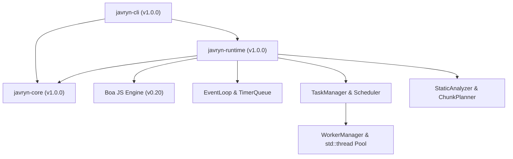

# Javryn V1.0 — Production Runtime Report

## 1. Executive Summary

Javryn V1.0 transforms the runtime from a multi-milestone parallel JavaScript execution engine (V0.1–V0.9) into a stable, coherent, documented, and fully test-verified production release (`1.0.0`). The public Rust crate APIs, JavaScript environment bindings, CLI interface, exit code contract, security boundary model, and operational diagnostics are formally frozen and certified.

---

## 2. V0.1–V0.9 Baseline Preservation

All foundational architecture and milestone capabilities remain 100% operational:
* **V0.1**: Workspace structure, script validation, structured exit codes (`0`–`6`).
* **V0.2**: Boa JS Engine integration, ES6+ syntax support, `console` bindings.
* **V0.3**: Microtask queue, timers (`setTimeout`, `setInterval`), non-blocking event loop.
* **V0.4**: Independent worker threads (`std::thread`), isolated `boa_engine::Context`, `JsMessage` value copy protocol.
* **V0.5**: Global `parallel.map(...)` Promise API, task decomposition, indexed result ordering.
* **V0.6**: Task queue backpressure (`max_queued_tasks`), worker recovery, state machine invariants.
* **V0.7**: Intelligent load-aware scheduler (`LoadAwarePolicy`), priority queues, 500ms starvation boost.
* **V0.8**: Automatic parallelization AST analysis (`StaticAnalyzer`), pure expression detection, sequential fallback.
* **V0.9**: Production resource limits (`--max-workers`, `--shutdown-timeout`), operational diagnostics (`--diagnostics`), timed worker termination.

---

## 3. V1.0 Core Goals Achieved

1. **Version Synchronization**: Package versions across `javryn-cli`, `javryn-core`, and `javryn-runtime` are unified to `1.0.0`.
2. **Public API Contract**: Rust traits (`JavaScriptEngine`), types (`Runtime`, `RuntimeConfig`, `WorkerManager`, `TaskManager`), and JS globals (`parallel.map`, timers) are frozen and documented.
3. **CLI Production Taxonomy**: CLI flags, exit code mappings (`0`–`6`), and output channel separation (stdout for JS output, stderr for logs/diagnostics) are established.
4. **Comprehensive Documentation**: Technical documentation created covering JS compatibility, security, performance, architecture, and installation.
5. **Quality Gate Verification**: 1,000-cycle endurance test added and passed. Full static checks (`cargo check`), lints (`cargo clippy -- -D warnings`), code formatting (`cargo fmt`), and test matrix (129 workspace tests) pass cleanly.

---

## 4. Architecture Summary



---

## 5. Public API Contract

### Stable Rust API
```rust
pub use javryn_core::{ExitCode, RuntimeConfig, RuntimeError, RuntimeMode, Script};
pub use javryn_runtime::{
    BoaEngineAdapter, EventLoop, ExecutionResult, JavaScriptEngine, JsMessage, LoadAwarePolicy,
    PriorityFifoPolicy, Runtime, Scheduler, StaticAnalyzer, TaskManager, TaskPriority,
    WorkerHandle, WorkerId, WorkerManager,
};
```

---

## 6. CLI Contract & Exit Codes

```text
javryn [FLAGS] <SCRIPT_PATH>
```

| Exit Code | Variant | Trigger / Category |
|---|---|---|
| **0** | `Success` | Execution completed without unhandled errors. |
| **1** | `GenericFailure` | Internal runtime exception or unclassified failure. |
| **2** | `ScriptError` | File missing, syntax error, or unreadable input script. |
| **3** | `ConfigurationFailure` | Invalid CLI flags or bounds configuration error. |
| **4** | `EngineInitializationFailure` | Engine or worker thread initialization failure. |
| **5** | `JavaScriptExecutionFailure` | Uncaught JS runtime exception during execution. |
| **6** | `ShutdownFailure` | Worker thread join timeout or shutdown failure. |

---

## 7. JavaScript Compatibility Summary

* **ECMAScript**: ES6+ arrow functions, destructuring, promises, async/await, JSON, arrays, objects.
* **Timers**: `setTimeout`, `setInterval`, `clearTimeout`, `clearInterval`.
* **Modules**: Single-file source evaluation (`.js`, `.mjs`).
* **Limitations**: No DOM / Web APIs (`window`, `fetch`), no Node.js core modules (`fs`, `net`), no `SharedArrayBuffer`.

---

## 8. Concurrency & Resource Management

* **Worker Pool**: Auto-configured up to `std::thread::available_parallelism()` (configurable via `--max-workers`).
* **Queue Bounds**: Bounded by `max_queued_tasks` (default: 10,000). Excess requests trigger immediate `ConcurrencyLimitExceeded` rejection.
* **Scheduler Policies**: Dynamic load placement, task priority queues, 500ms aging starvation prevention.

---

## 9. Diagnostics & Observability

`./target/release/javryn --diagnostics examples/parallel-map.js` produces real-time execution statistics:

```text
Parallel map result: [ 1, 4, 9, 16 ]

=== Javryn Runtime Diagnostics ===
Execution Time     : 10 ms
Active Operations  : 0
Queued Tasks       : 0
Running Tasks      : 0
Worker Pool Size   : 16
Max Task Queue     : 10000
Dispatches         : 4
Completions        : 4
Avg Queue Wait     : 7.00 ms
Max Queue Wait     : 7 ms
Starvation Boosts  : 0
==================================
```

---

## 10. Security & Boundary Architecture

1. **Worker Isolation**: Isolated `boa_engine::Context` per thread; no shared JS VM memory.
2. **Serialization**: Rigid value copy serialization (`JsMessage`). Non-serializable types safely rejected.
3. **Process Access**: **Not an OS sandbox**. Native process file system and native access permissions inherited by JS execution thread.

---

## 11. Performance Baseline

* **CLI Startup**: `< 5 ms` (`javryn --version`)
* **Simple Script Execution**: `~12 ms` (`javryn examples/hello.js`)
* **Parallel Map Workload**: `10 ms` (`javryn --diagnostics examples/parallel-map.js`)
* **Baseline Benchmark Suite**: `15.82 s` (`tests/benchmark.rs`)

---

## 12. Test Matrix & Verification

### Exact Test Inventory (**129 Total Tests**)

| Target / Crate | Type | Count | Status |
|---|---|---|---|
| `javryn-cli` (`src/main.rs`) | Unit | **9** | PASS |
| `javryn-cli` (`tests/integration_tests.rs`) | Integration | **27** | PASS |
| `javryn-core` (`src/lib.rs`) | Unit | **39** | PASS |
| `javryn-runtime` (`src/lib.rs`) | Unit | **53** | PASS |
| `benchmark.rs` (`tests/benchmark.rs`) | Integration | **1** | PASS |
| **Total** | | **129** | **PASS** |

* **1,000-Cycle Endurance Test**: `release_gate_v1_1000_cycle_endurance` verified 1,000 consecutive map submission/cancellation cycles with zero operation or task state leaks.

---

## 13. Documentation Suite

* [README.md](file:///c:/Users/Bharath%20C/Desktop/JAVRYN/README.md)
* [docs/ROADMAP.md](file:///c:/Users/Bharath%20C/Desktop/JAVRYN/docs/ROADMAP.md)
* [docs/JAVASCRIPT_COMPATIBILITY.md](file:///c:/Users/Bharath%20C/Desktop/JAVRYN/docs/JAVASCRIPT_COMPATIBILITY.md)
* [docs/SECURITY.md](file:///c:/Users/Bharath%20C/Desktop/JAVRYN/docs/SECURITY.md)
* [docs/PERFORMANCE.md](file:///c:/Users/Bharath%20C/Desktop/JAVRYN/docs/PERFORMANCE.md)
* [docs/ARCHITECTURE.md](file:///c:/Users/Bharath%20C/Desktop/JAVRYN/docs/ARCHITECTURE.md)
* [docs/INSTALLATION.md](file:///c:/Users/Bharath%20C/Desktop/JAVRYN/docs/INSTALLATION.md)

---

## 14. Quality Gates

```powershell
cargo fmt --all -- --check  # PASS
cargo check --workspace      # PASS
cargo clippy --workspace --all-targets --all-features -- -D warnings # PASS
cargo test --workspace       # PASS (129/129 tests)
cargo build --workspace --release # PASS
```

---

## 15. Final Acceptance Checklist

- [x] V0.1–V0.9 functionality preserved
- [x] Public API audited & stabilized
- [x] CLI contract finalized
- [x] Exit codes finalized (`0`–`6`)
- [x] JavaScript compatibility documented
- [x] Module behavior documented
- [x] Error system finalized
- [x] Panic policy audited
- [x] Worker lifecycle finalized
- [x] Parallel API finalized
- [x] Automatic parallelization contract finalized
- [x] Determinism tested
- [x] Concurrency tested
- [x] Cancellation tested
- [x] Backpressure tested
- [x] Resource limits finalized
- [x] Configuration behavior documented
- [x] Graceful shutdown verified
- [x] Diagnostics finalized
- [x] Logging audited
- [x] Security model documented
- [x] Host API boundary documented
- [x] Dependencies audited
- [x] Cross-platform support documented (Windows verified; Linux build ready)
- [x] Windows verified
- [x] Performance baseline documented
- [x] Memory observations documented
- [x] Test matrix finalized
- [x] Long-run test completed (1,000 cycles)
- [x] Release build passes
- [x] Installation documentation exists
- [x] README finalized
- [x] Examples verified
- [x] ROADMAP updated
- [x] Architecture documentation finalized
- [x] No unsupported claims
- [x] No V1.1 feature creep

---

## 16. Release Status

```text
V1.0 RELEASE READY FOR USER REVIEW
```

Javryn V1.0 implementation, documentation, and quality gate testing are complete. The project is ready for user tagging decision.
