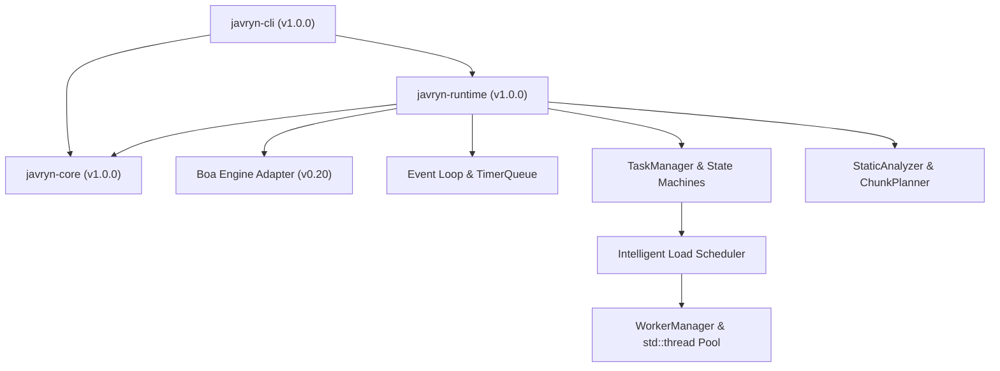

# Javryn Architecture Overview (V1.0)

## Overview

Javryn is a production-grade parallel JavaScript runtime written in Rust. It decouples command-line configuration, domain primitives, asynchronous event multiplexing, worker thread isolation, load-aware scheduling, and automatic parallelization analysis across a three-crate workspace architecture.

---

## 1. System Crate Architecture



### Crate Responsibilities

#### `javryn-cli` (Command-Line Interface)
- Command-line argument parsing (`clap`) supporting `--max-workers`, `--max-queued-tasks`, `--shutdown-timeout`, `--diagnostics`, `--auto-parallel`, `--quiet`, `--verbose`, and `--debug`.
- Diagnostic output formatting (`stdout` for script evaluation vs `stderr` for logging and operational diagnostics).
- Exit code translation (`ExitCode` mapping to codes `0`–`6`).
- Signal handling (`ctrlc`) triggering graceful runtime cancellation and worker pool teardown.

#### `javryn-core` (Domain Core & Vocabularies)
- Domain types (`Script`, `ScriptMetadata`, `RuntimeConfig`, `RuntimeMode`).
- Configuration boundary enforcement (`max_workers`, `max_queued_tasks`, `shutdown_timeout_ms`).
- Error model hierarchy (`RuntimeError`) and process exit mapping (`ExitCode`).

#### `javryn-runtime` (Runtime Execution Engine)
- Engine abstraction (`JavaScriptEngine` trait & concrete `BoaEngineAdapter`).
- Single-threaded main event loop (`EventLoop`) managing Promise microtasks and macro-task timers (`TimerQueue`).
- Worker thread pool manager (`WorkerManager`) spawning OS threads (`std::thread`) with dedicated `boa_engine::Context` instances.
- Task queue coordinator (`TaskManager`) tracking `TaskStatus` and `OperationStatus` state machines, backpressure limits, and result array assembly.
- Intelligent scheduler (`Scheduler`) enforcing `LoadAwarePolicy`, priority dispatch (`TaskPriority`), starvation prevention (500ms aging boost), and queue latency metrics.
- Automatic parallelization inspector (`StaticAnalyzer`) performing AST safety checks and chunking (`ChunkPlanner`).

---

## 2. Multi-Worker & Parallel Architecture

```text
                               JAVRYN
                                 │
                   ┌─────────────┴─────────────┐
                   │                           │
            Main JavaScript               Parallel API
               Runtime                  `parallel.map`
                   │                           │
                   │                      TaskManager
                   │                           │
                   │                       Scheduler
                   │                           │
                   │                    WorkerManager
                   │                           │
                   │              ┌────────────┼────────────┐
                   │              ▼            ▼            ▼
                   │           Worker 1     Worker 2     Worker N
                   │              │            │            │
                   │             Boa          Boa          Boa
                   │              │            │            │
                   │          EventLoop    EventLoop    EventLoop
                   │
                   └───────────── Worker Responses
                                   │
                                   ▼
                              Main Event Loop
                                   │
                                   ▼
                              Promise Result
```

### Parallel Subsystem Responsibilities

1. **Host Parallel API (`parallel.map`)**: JavaScript host global registered in the main context. Serializes callback source strings and items via `JsMessage` and submits operations to `TaskManager`.
2. **Task Queue Coordinator (`TaskManager`)**: Assigns unique `OperationId` and `TaskId` identifiers, manages task lifecycle state machines (`TaskStatus::Created` $\rightarrow$ `Queued` $\rightarrow$ `Running` $\rightarrow$ `Completed` / `Failed` / `Cancelled`), enforces queue backpressure (`max_queued_tasks`), and reconstructs result arrays by `InputIndex`.
3. **Intelligent Scheduler (`Scheduler`)**: Selects optimal workers (`LoadAwarePolicy`), orders tasks by priority (`TaskPriority::High`, `Normal`, `Low`), automatically boosts tasks queued longer than 500ms to prevent starvation, and collects queue wait metrics.
4. **Worker Pool Manager (`WorkerManager`)**: Handles thread pool allocation, post-message dispatches (`WorkerMessage::ExecuteTask`), worker crash recovery (`handle_worker_failure`), and timed thread termination (`terminate_with_timeout`).
5. **Isolated Worker Threads**: Dedicated OS threads (`std::thread`) running isolated Boa ECMAScript contexts. Messages are processed without sharing JS VM memory, returning results via MPSC channels (`WorkerResponse::TaskCompleted`).

---

## 3. Automatic Parallelization Architecture

```text
                       Javryn Runtime
                             │
                    JavaScript Engine (Boa)
                             │
                 Automatic Parallelization Pass
                             │
                 ┌───────────┴───────────┐
                 │                       │
           Static Analysis         Safety Analysis
                 │                       │
                 └───────────┬───────────┘
                             │
                 Parallelization Decision
                   /                  \
                  /                    \
             [ SAFE ]              [ UNSAFE ]
                │                      │
                ▼                      ▼
         Chunk Planner            Sequential JS
                │                  Fallback
                ▼                      │
           TaskManager                 │
                │                      │
            Scheduler                  │
                │                      │
          WorkerManager                │
                │                      │
         ┌──────┼──────┐               │
         ▼      ▼      ▼               │
        W1     W2     WN ──────────────┘
```

### Subsystem Flow
- **Safety Inspection**: `StaticAnalyzer` inspects statement structures to verify callback purity. Iteration read/write sets ($R_i \cap W_j$) are screened for state mutation or side effects.
- **Decision Engine**: Safe workloads produce `ParallelizationDecision::Parallel` (dispatched to `ChunkPlanner` $\rightarrow$ `TaskManager` $\rightarrow$ `Scheduler`), while unsafe workloads produce `ParallelizationDecision::Sequential` with guaranteed sequential fallback.

---

## 4. Operational Diagnostics Architecture

When `--diagnostics` is enabled, `TaskManager` and `Scheduler` collect runtime execution metrics exposed via `TaskManagerDiagnostics`:

* **Execution Metrics**: Total elapsed execution time (ms), active operations, queued tasks, running tasks, worker pool utilization.
* **Scheduler Metrics**: Total dispatches, completions, average queue wait latency (ms), maximum queue wait latency (ms), and starvation boosts.
